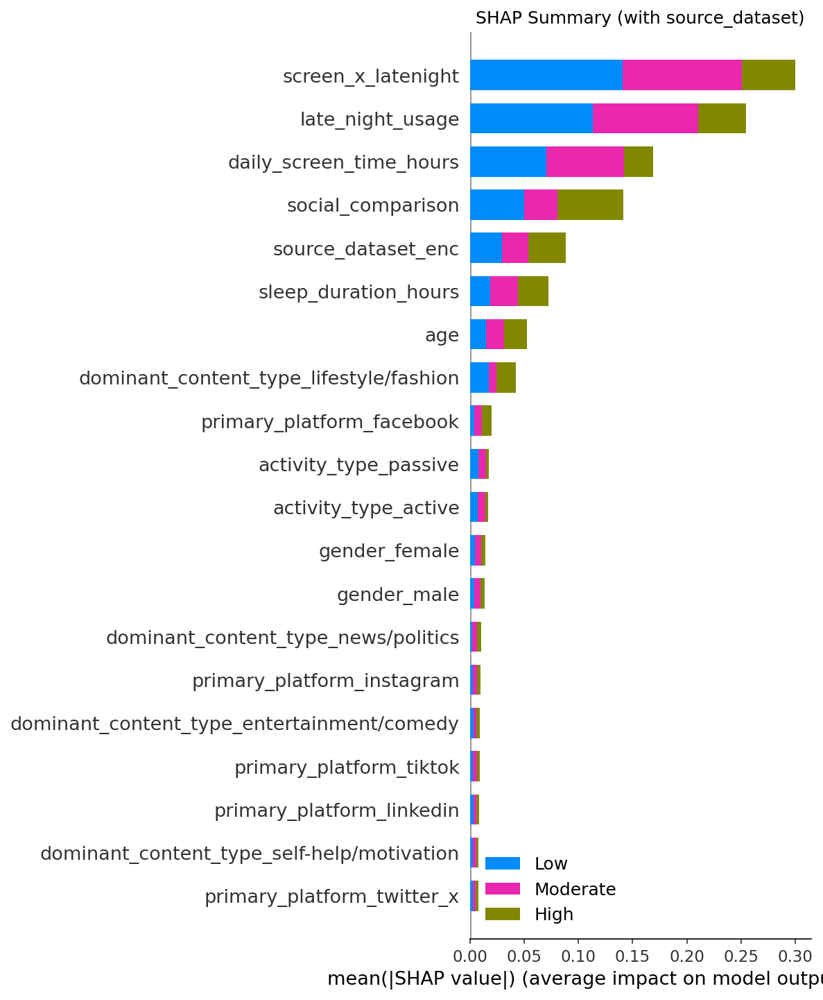
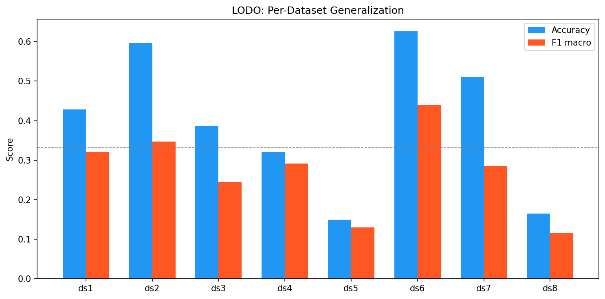
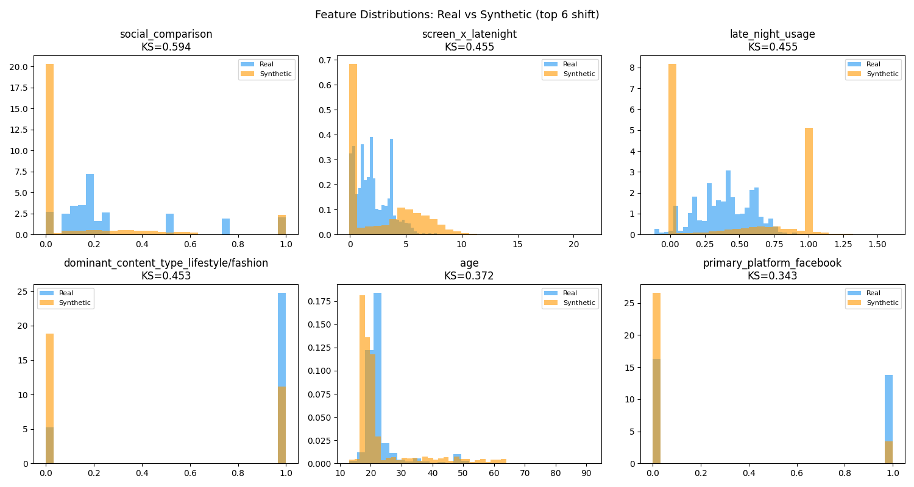
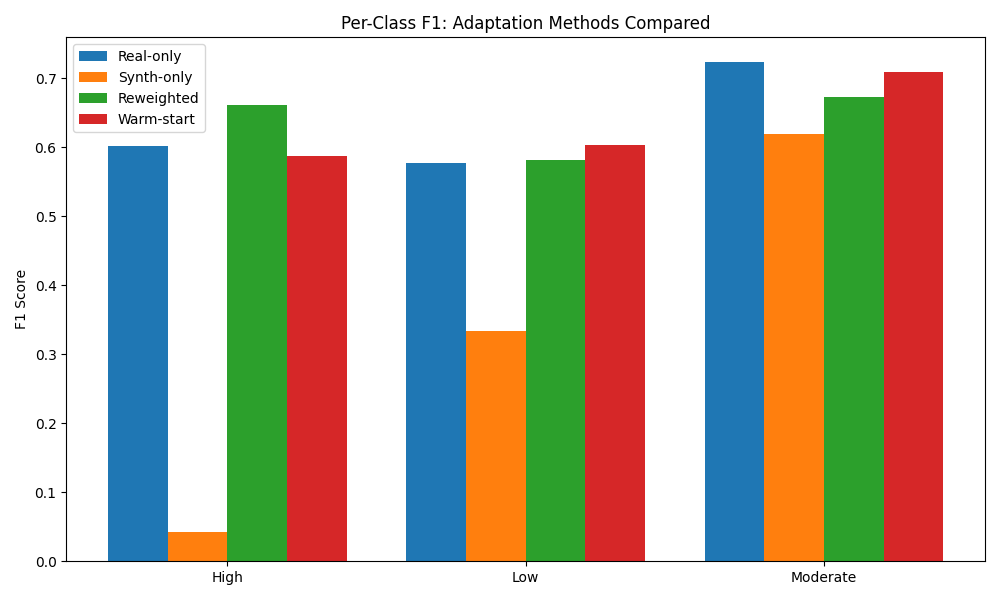

# Cross-Survey Mental Health Risk Prediction

Predicting mental health risk from social media usage by harmonizing 8 heterogeneous survey datasets with different psychological instruments into a unified modeling pipeline.

## Motivation

Mental health surveys use wildly different instruments: GAD-7 (0-21), PHQ-9 (0-27), Likert scales (1-5), binary yes/no. Combining such datasets is a real challenge in applied data science because naive approaches (rescaling all scores to a common range) introduce confounders and lose clinical meaning.

This project tackles the harmonization problem head-on: constructing a defensible composite target from theoretically grounded normalization, then validating whether the resulting model actually generalizes across datasets or merely learns dataset identity.

## Key Contributions

- **Principled target harmonization** across 5 different MH instruments using theoretical range normalization and equal-weight compositing, with explicit feature/target separation (subjective states as target, observable behaviors as features)
- **Confounder elimination verified** via source ablation: adding dataset identity as a feature yields only +0.004 F1 gain, confirming the composite does not encode dataset-of-origin
- **Cross-dataset generalization analysis** using Leave-One-Dataset-Out (LODO) validation, revealing a real-synthetic generalization gap (within-type F1 ~0.9 vs cross-type F1 ~0.3)
- **Distribution shift diagnosis**: the gap traces to self-selection bias in voluntary MH surveys (real data: 32% High Risk, synthetic: 4%), not feature distribution differences
- **Domain adaptation**: reweighting real samples 10x recovers High Risk F1 from 0.04 to 0.66

## Datasets

| # | Source | Rows | MH Instruments | Type |
|---|--------|------|---------------|------|
| 1 | Google Forms survey | 49 | 4-category self-report | Real |
| 2 | NumPy-generated (CDC/WHO distributions) | 2,000 | Anxiety/Depression/Stress (0-20), Mood (1-10) | Synthetic |
| 3 | Designed correlations | 500 | Happiness (1-10), Stress (1-10) | Synthetic |
| 4 | University stats course survey | 481 | 6 Likert items (1-5): worry, concentration, depression, etc. | Real |
| 5 | Synthetic generator | 20 | MHI (25-90), FOMO (2-10) | Synthetic |
| 6 | Scientifically grounded synthetic | 8,000 | GAD-7 (0-21), PHQ-9 (0-27) | Synthetic |
| 7 | Student survey | 705 | MH score (4-9) | Real |
| 8 | Synthetic (Emirhan BULUT) | 103 | Dominant emotion (6-category) | Synthetic |

**Total: 11,858 samples, 30 features after one-hot encoding, 3-class target (Low / Moderate / High Risk)**

## Pipeline

```
01_clean_and_target.py    Per-dataset cleaning, column standardization, composite target construction
        |
02_merge.py               Cross-dataset alignment and sanity checks
        |
03_eda.py                 Exploratory data analysis (6 charts)
        |
04_imputation_fe.py       Imputation comparison (Median vs KNN vs MICE), feature engineering
        |
05_modeling.py            Classification (6 models), LODO validation, regression
        |
06_evaluation.py          SHAP analysis, confusion matrices, feature importance
        |
06b_extended_analysis.py  Real vs synthetic analysis, source ablation, feature consistency
        |
06c_pretrain_finetune.py  Synthetic-to-real transfer: reweighting, warm-start, calibration
        |
06d_deepdive_shift.py     Distribution shift diagnosis (KS tests), per-class adaptation
        |
06e_shap_with_source.py   SHAP with dataset identity as feature (confounder check)
```

## Results

### Classification (5-fold stratified CV)

| Model | Accuracy | F1 (macro) |
|-------|----------|------------|
| Random Forest | 0.808 | **0.714** |
| XGBoost | 0.818 | 0.698 |
| Gradient Boosting | 0.812 | 0.691 |
| Decision Tree | 0.711 | 0.628 |
| Stacking (RF+XGB) | 0.676 | 0.600 |
| Logistic Regression | 0.662 | 0.584 |

### SHAP Feature Importance

Top features: late-night usage (0.100), screen time x late-night interaction (0.089), social comparison (0.059), daily screen time (0.053), sleep duration (0.022). Dataset identity ranks 5th when included, confirming it is present but not dominant.



### Cross-Dataset Generalization (LODO)

Standard CV gives F1=0.714, but LODO reveals the model struggles to generalize across datasets (mean F1=0.272). The gap is largest for synthetic-to-real transfer.



### Distribution Shift and Adaptation

The generalization gap traces to target distribution shift caused by self-selection bias: respondents with MH concerns are overrepresented in real surveys. Reweighting real samples recovers minority class detection.




## Usage

```bash
# Clone
git clone https://github.com/liyux/cross-survey-mental-health-prediction.git
cd cross-survey-mental-health-prediction

# Install dependencies
pip install -r requirements.txt

# Run pipeline (scripts are sequential, run in order)
cd pipeline
python 01_clean_and_target.py
python 02_merge.py
python 03_eda.py
python 04_imputation_fe.py
python 05_modeling.py
python 06_evaluation.py
python 06b_extended_analysis.py
python 06c_pretrain_finetune.py
python 06d_deepdive_shift.py
python 06e_shap_with_source.py
```

All outputs (figures, CSVs, models) are saved to `output/`.

## Report

The full technical report is available at [`report.pdf`](report.pdf).

## License

MIT
