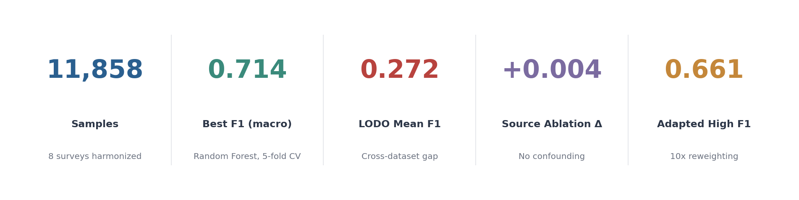
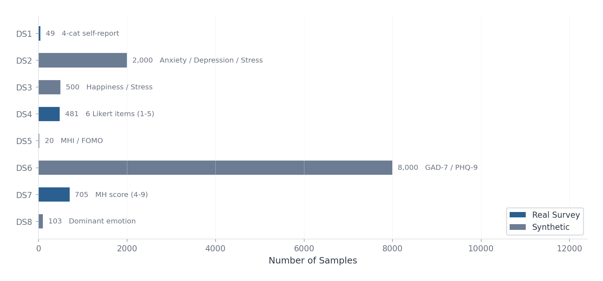
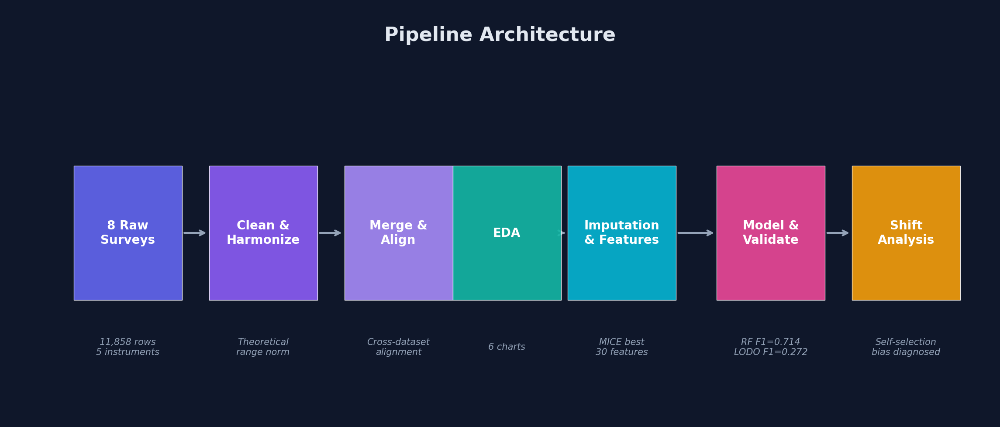
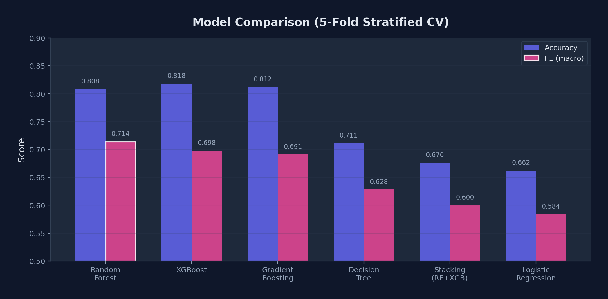
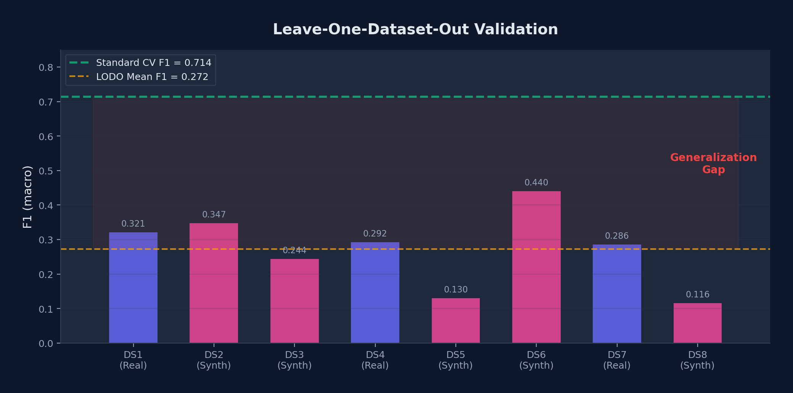
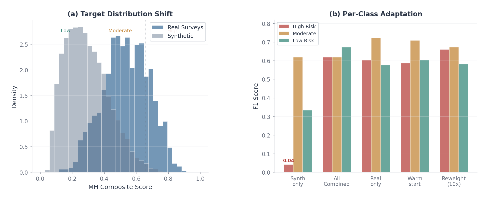

<p align="center">
  <h1 align="center">Cross-Survey Mental Health Risk Prediction</h1>
  <p align="center">
    Harmonizing 8 heterogeneous mental health surveys into a unified risk prediction pipeline,<br>
    with cross-dataset validation exposing the real-synthetic generalization gap.
  </p>
  <p align="center">
    <a href="https://cross-survey-mental-health-prediction.streamlit.app/">Try it online</a> &middot;
    <a href="#key-findings">Findings</a> &middot;
    <a href="#pipeline-architecture">Pipeline</a> &middot;
    <a href="#results">Results</a> &middot;
    <a href="#quick-start">Quick Start</a> &middot;
    <a href="report.pdf">Report</a>
  </p>
  <p align="center">
    
    
    
    
    
  </p>
</p>

<br>

<p align="center">
  
</p>

## Motivation

Mental health surveys measure the same construct with different instruments: GAD-7 (0-21), PHQ-9 (0-27), Likert scales (1-5), binary yes/no. Naively rescaling all scores to a common range introduces confounders, where models learn to predict *which dataset a sample came from* rather than actual mental health risk.

This project addresses the harmonization problem with theoretically grounded normalization, then validates whether the resulting model generalizes across datasets or merely memorizes dataset identity.

## Key Findings

- Source ablation delta of +0.004 confirms our target construction eliminates dataset-identity confounding
- LODO validation (train on 7, test on the 8th) exposes a generalization gap: standard CV F1 = 0.714 vs LODO mean F1 = 0.272
- The gap traces to self-selection bias: individuals with MH concerns are overrepresented in voluntary real surveys (32% High Risk vs 4% in synthetic data)
- Reweighting real samples 10x recovers High Risk F1 from 0.04 to 0.66
- 7 features remain stable across all 8 LODO folds: screen time, late-night usage, social comparison, sleep duration, age, gender

## Dataset Landscape

<p align="center">
  
</p>

8 Kaggle survey datasets (3 real, 5 synthetic), totaling 11,858 samples. Each uses different MH instruments, from standardized clinical scales (GAD-7, PHQ-9) to ad-hoc Likert items. After harmonization: 30 features, 3-class target (Low / Moderate / High Risk).

<details>
<summary><b>Dataset Details</b></summary>
<br>

| # | Source | Rows | MH Instruments | Type |
|---|--------|-----:|---------------|:----:|
| 1 | Google Forms survey | 49 | 4-category self-report | Real |
| 2 | CDC/WHO distribution synthetic | 2,000 | Anxiety/Depression/Stress (0-20), Mood (1-10) | Synth |
| 3 | Designed-correlation synthetic | 500 | Happiness (1-10), Stress (1-10) | Synth |
| 4 | University stats course survey | 481 | 6 Likert items (1-5) | Real |
| 5 | Synthetic generator | 20 | MHI (25-90), FOMO (2-10) | Synth |
| 6 | Scientifically grounded synthetic | 8,000 | GAD-7 (0-21), PHQ-9 (0-27) | Synth |
| 7 | Student survey | 705 | MH score (4-9) | Real |
| 8 | Synthetic (E. BULUT) | 103 | Dominant emotion (6-cat) | Synth |

Target construction: per-dataset MH variables are normalized to [0, 1] using theoretical instrument ranges (not observed min-max), then averaged into a composite score. Subjective psychological states (anxiety, depression, stress) become the target; observable behaviors (screen time, sleep duration) become features.
</details>

## Pipeline Architecture

<p align="center">
  
</p>

| Step | Script | What it does |
|:----:|--------|-------------|
| 1 | `01_clean_and_target.py` | Per-dataset cleaning, column standardization, composite target construction |
| 2 | `02_merge.py` | Cross-dataset feature alignment, sanity checks |
| 3 | `03_eda.py` | Distribution analysis, correlation mapping, missingness profiling |
| 4 | `04_imputation_fe.py` | Imputation comparison (Median vs KNN vs MICE), interaction features |
| 5 | `05_modeling.py` | 6-model classification, LODO validation, regression baseline |
| 6a | `06_evaluation.py` | SHAP analysis, confusion matrices, feature importance |
| 6b | `06b_extended_analysis.py` | Real vs synthetic split, source ablation, feature consistency |
| 6c | `06c_pretrain_finetune.py` | Synthetic-to-real transfer: reweighting, warm-start, calibration |
| 6d | `06d_deepdive_shift.py` | KS-test distribution shift diagnosis, per-class adaptation |
| 6e | `06e_shap_with_source.py` | SHAP with dataset identity as feature (confounder verification) |

## Results

### Model Comparison

<p align="center">
  
</p>

Random Forest achieves the best F1 macro (0.714) due to better minority class recall. XGBoost leads on accuracy (0.818) but under-detects High Risk. Stacking underperforms as the base models (RF + XGB) are too correlated for the meta-learner to gain from.

### The Generalization Gap

<p align="center">
  
</p>

Standard 5-fold CV reports F1 = 0.714. LODO reveals the model cannot generalize across datasets (mean F1 = 0.272). Within-type transfer works well (Real-to-Real F1 = 0.925), but cross-type fails, pointing to a systematic shift rather than random noise.

### Distribution Shift and Adaptation

<p align="center">
  
</p>

Root cause: self-selection bias in voluntary MH surveys. Respondents with mental health concerns are overrepresented in real data, creating a target distribution mismatch (KS = 0.456). Synthetic generators approximate general population distributions instead.

Reweighting real samples 10x during training recovers High Risk detection (F1: 0.04 to 0.66) with minimal trade-off on other classes. Warm-start transfer preserves feature ranking (Spearman rho = 0.736) but does not improve calibration.

<details>
<summary><b>More Results: Feature Importance and Stability</b></summary>
<br>

SHAP top 5: late-night usage (0.100), screen_time x late_night interaction (0.089), social comparison (0.059), daily screen time (0.053), sleep duration (0.022).

When dataset identity is added as a feature, it ranks 5th (SHAP = 0.030), confirming it carries some signal but is not dominant. The source ablation delta (+0.004 F1) corroborates this: our target construction successfully prevents the model from relying on dataset identity.

Feature stability across LODO folds: 7 features appear in the top-10 importance across all 8 folds, suggesting the model captures genuine behavioral-MH associations rather than dataset-specific artifacts.
</details>

## Interactive Demo

[Try it online](https://cross-survey-mental-health-prediction.streamlit.app/), adjust social media usage parameters and get a real-time risk prediction with class probabilities and feature importance.

Or run locally:

```bash
pip install -r requirements.txt
streamlit run app.py
```

The app loads the trained Random Forest model and shows predicted risk level (Low / Moderate / High), confidence scores, and the top contributing factors for each prediction.

## Quick Start

```bash
git clone https://github.com/Liyux3/cross-survey-mental-health-prediction.git
cd cross-survey-mental-health-prediction
pip install -r requirements.txt
```

Run the pipeline sequentially:

```bash
cd pipeline
python 01_clean_and_target.py
python 02_merge.py
python 03_eda.py
python 04_imputation_fe.py
python 05_modeling.py
python 06_evaluation.py
python 06b_extended_analysis.py
python 06c_pretrain_finetune.py
python 06d_deepdive_shift.py
python 06e_shap_with_source.py
```

All outputs (figures, CSVs, trained models) are written to `output/`.

<details>
<summary><b>Requirements</b></summary>
<br>

Python 3.9+ with: `numpy`, `pandas`, `scikit-learn`, `xgboost`, `shap`, `matplotlib`, `seaborn`, `scipy`, `openpyxl`

Full list in [`requirements.txt`](requirements.txt).
</details>

## Report

The full 6-page technical report with methodology details, justifications, and additional analyses is available at [`report.pdf`](report.pdf).

## Citation

If you use this work, please cite:

```bibtex
@misc{li2026crosssurvey,
  title   = {Cross-Survey Mental Health Risk Prediction},
  author  = {Li, Yuxiang},
  year    = {2026},
  url     = {https://github.com/Liyux3/cross-survey-mental-health-prediction}
}
```

## License

[MIT](LICENSE)
